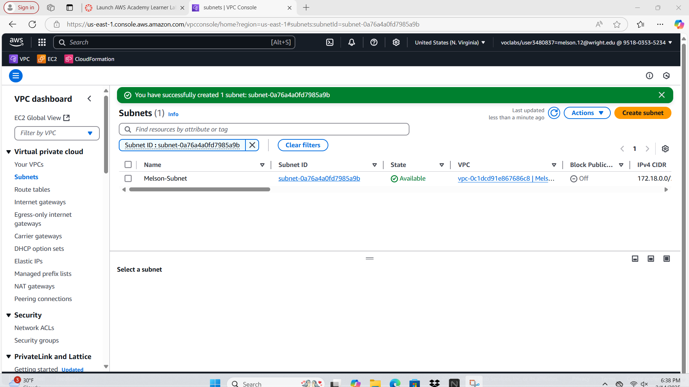
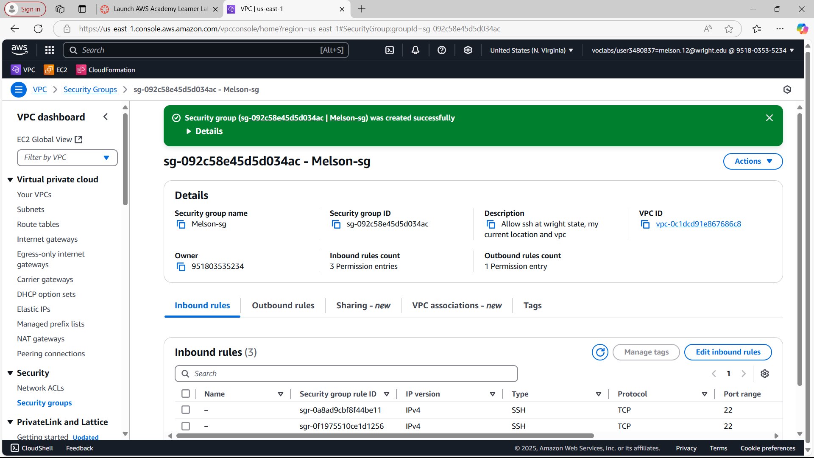
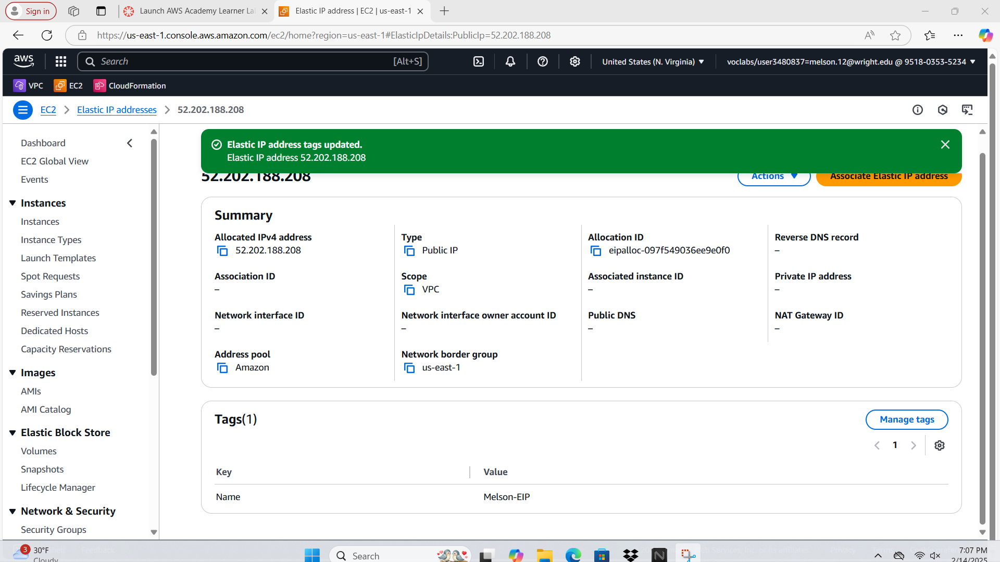

# Project 1 - Part 1: Build a VPC

## 1. VPC
**Description:**  
A VPC (Virtual Private Cloud) is a logically isolated section of the AWS cloud where you can launch AWS resources in a virtual network. It allows you to define your own IP address range, create subnets, configure route tables, and set up network gateways. A VPC provides control over your network environment, including security settings and connectivity options.

**Screenshot:**  
  

---

## 2. Subnet
**Description:**  
A subnet is a range of IP addresses within a VPC where you can place groups of isolated resources, such as EC2 instances. Subnets allow you to segment your network and control traffic flow between different parts of your infrastructure.

**Prompt Responses:**  
- **Reserved block for the subnet:** `172.18.0.0/24` (IP range: `172.18.0.0` to `172.18.0.255`).  
- **Remaining block(s) in the VPC:** `172.18.1.0/24` (since the VPC CIDR is `172.18.0.0/23`).

**Screenshot:**  
  

---

## 3. Internet Gateway
**Description:**  
An Internet Gateway (IGW) is a horizontally scaled, redundant, and highly available VPC component that allows communication between resources in your VPC and the internet. It provides a target in your VPC route tables for internet-routable traffic.

**Screenshot:**  
  

---

## 4. Route Table
**Description:**  
A route table contains a set of rules (routes) that determine where network traffic from your subnet is directed. Each subnet in your VPC must be associated with a route table, which controls the traffic flow to and from the subnet.

**Screenshot:**  
  

---

## 5. Security Group
**Description:**  
A security group acts as a virtual firewall for your EC2 instances to control inbound and outbound traffic. It operates at the instance level and supports allow rules only. Security groups are stateful, meaning that return traffic is automatically allowed regardless of the rules.

**Screenshot:**  
  

---

## 6. Network ACL
**Description:**  
A Network ACL (NACL) is a stateless firewall that controls traffic at the subnet level. It supports both allow and deny rules and evaluates rules in order when deciding whether to allow traffic. Unlike security groups, NACLs are stateless, meaning return traffic must be explicitly allowed.

**Screenshot:**  
  

---

## 7. Key Pair
**Description:**  
A key pair consists of a public key (stored by AWS) and a private key (downloaded by you) used to securely connect to your EC2 instances via SSH. The private key must be kept secure, as it is required to access your instances.

**Prompt Responses:**  
- **Public key:** Stored by AWS.  
- **Private key:** Downloaded by you during key pair creation. AWS does not store the private key.

**Screenshot:**  
  

---

## 8. Elastic IP
**Description:**  
An Elastic IP (EIP) is a static, public IPv4 address that you can allocate to your AWS account and associate with an EC2 instance. Unlike a public IP, which changes when the instance is stopped and restarted, an Elastic IP remains the same.

**Prompt Responses:**  
- **Elastic IP:** Persistent public IP address that remains the same even if the instance is stopped and restarted.  
- **Public IP:** Automatically assigned to an instance when launched but changes if the instance is stopped and restarted.

**Screenshot:**  
  

---

## Part 2 - EC2 Instance Creation

### What is an EC2 Instance?
An EC2 (Elastic Compute Cloud) instance is a virtual server in AWS that allows you to run applications and workloads in the cloud. It provides scalable computing capacity and can be configured with various operating systems, instance types, and storage options.

---

### How-to Launch an Instance

#### Step 1: Choose an AMI
1. Go to the **EC2 Dashboard** in the AWS Management Console.
2. Click **Launch Instance**.
3. Select an AMI.
   - **AMI ID:** Select your AMI ID.
   - **OS:** Select OS.
   - **Version:** What version is used.

#### Step 2: Choose an Instance Type
1. Select an instance type (I selected t2.micro)

#### Step 3: Configure Instance Details
1. **Network:** Select your VPC (`Melson-VPC`).
2. **Subnet:** Select your subnet (`Melson-Subnet`).
3. **Auto-assign Public IP:** Enable.

#### Step 4: Add Storage
1. Leave the default storage settings (or adjust as needed).

#### Step 5: Add Tags
1. Add a tag with:
   - **Key:** `Name`
   - **Value:** `Melson-instance`.

#### Step 6: Configure Security Group
1. Select the security group (`Melson-sg`).

#### Step 7: Review and Launch
1. Review your settings and click **Launch**.
2. When prompted, select your key pair (`Melson-keypair`) and acknowledge that you have access to the private key.

---

### Instance Details
- **AMI Selected:**
  - **AMI ID:** `ami-04b4f1a9cf54c11d0`
  - **OS:** `Ubuntu`.
  - **Version:** `Latest`.
- **Default Username:** `Linux` 
- **Instance Type:** `t2.micro`
- **Key Pair:** `Melson-keypair`.

---

### Why Select a Key Pair?
A key pair is required to securely connect to your EC2 instance via SSH. It consists of a public key (stored by AWS) and a private key (downloaded by you). The private key is used to authenticate your SSH connection, ensuring secure access to the instance. Without a key pair, you cannot securely access your instance.

---

### How-to Associate the Elastic IP (EIP)
1. Go to the **Elastic IPs** section in the EC2 Dashboard.
2. Select the Elastic IP you allocated earlier (`Melson-ElasticIP`).
3. Click **Actions > Associate Elastic IP address**.
4. Select your instance (`Melson-instance`) and click **Associate**.

---

### Screenshot

